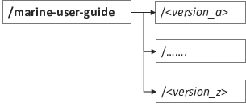

.. Marine user manual documentation master file, created by
   sphinx-quickstart on Mon Jun 22 22:10:11 2020.
   You can adapt this file completely to your liking, but it should at least
   contain the root `toctree` directive.

Welcome to Marine user guide's documentation!
==============================================

.. toctree::
   :maxdepth: 3
   :caption: Contents:

Introduction
============

This project contains the necessary code to produce the data summaries that are
included in the Marine User Guide (MUG). These help document the status of the marine
in situ data in the CDS after every new data release. The marine data available
in the CDS is the result of a series of data releases that are stored in the
marine data file system in different directories. This project uses the data in
the marine file system, rather than accessing the CDS data.

Additionally, the tools employed to create the individual source deck reports
are also available in this project. These can be created for a single data
release or for the combination of releases included in a Marine User Guide
version.

Every new data release can potentially be created with a different version of
the marine processing software. The current version of this project is
compatible with the glamod-marine-processing [#gmp]_ code 
(https://glamod-marine-processing.readthedocs.io) up to version v8.0.0 
(https://zenodo.org/records/17404810).

Tool set-up
===========

Code set up
-----------

To clone the latest available version of the Marine User Guide repository:

.. code-block:: bash

  git clone https://github.com/glamod/marine-user-guide

Build the python environment using the requirements.txt.  

.. code-block:: bash

  cd marine-user-guide
  python -m venv .venv/MUG
  source .venv/MUG/bin/activate
  pip install -r marine-user-guide/env/requirements.txt

Paths setup
-----------

Some directory paths and handles are used throughout this document and are summarized in Table 1.
  
.. table:: Some directory paths and handles used throughout the document.
  
  ============= ============================================ ============================================================== 
  Shorthand     Description                                  Example                                                       
  ============= ============================================ ==============================================================    
  <MUG>         Marine User Guide home directory             /ichec/work/glamod/glamod_marine/marine-user-guide            
  <MUG_data>    Marine User Guide data directory             /ichec/work/glamod/data/marine/marine/marine-user-guide_202510
  <MUG_version> Tag of the MUG version                       v10                                                            
  <release      Tag of GLAMOD data release                   release_8.0                                                   
  <log_dir>     Directory for log files                      <MUG_data>/<version>/level2/log                               
  <MUG_list>    ASCII file for sid-dck partitions to process <MUG>/config/<release>/mug_list_full.txt                     
  <MUG_config>  Marine User Guide configuration JSON file    <MUG>/config/<release>/mug_config.json
  ============= ============================================ ==============================================================

Marine User Guide
=================

Every C3S Marine User Guide version includes a series of figures that describe
the marine in situ data holdings in the CDS. The following sections explain how
these figures are created for every new version of the Marine User Guide.

Initializing a new user guide
-----------------------------

The data the tools in this project use and the products created are stored in the marine-user-guide data directory.
This directory does not contain the actual data files, but links to the files in the data releases’ directories. 
This approach greatly simplifies the configuration of the different scripts and is followed even if a given Marine User Guide version is made up of a single data release.

The marine-user-guide data directory is then split in directories to host subsequent versions of the Marine User Guide (figure 1).

Edit <MUG_list> and <MUG_config> as needed for <MUG_version>.

Every new version of the MUG needs to be initialized in the tools data directory as shown in figure 2.

.. figure:: ../pics/file_links.png
  :width: 300
  :align: center

  Marine User Guide data directory and its relation to the individual data releases' directories.

These steps initialize a new version:

1. Create the data configuration file (*mug_file*) by merging the level2 configuration files of the different data releases included in the new version (`level2`).

.. code-block:: bash

  source <MUG>/setenv.sh 
  python <MUG>/init_version/init_config.py

See table 1 for the meaning of the shorthands.
This step copies a <MUG_config> and a <MUG_list> to <MUG_data>/<MUG_version>.
Hereinafter, referred to as **MUG_version_config** and **MUG_version_list**
An example of this step is as follows:

.. code-block:: bash

  $ python init_version/init_config.py
  Input name of release (no path: release_8.0)

2. Create the directory tree for the version in the marine-user-guide data directory.

  .. code-block:: bash

    python <MUG>/init_version/create_version_dir_tree.py <MUG_version_config> <MUG_version_list>

Note that the first two lines do not need to be repeated if these steps are performed in one session. 
For completeness we will repeat them every time here.

4. Populate it with a view of the merged data releases: rather than copying all the files, 
this is done by linking the corresponding files from the releases directories to the marine-user-guide data directory. 
Data linked is the level2 data files and level1a and level1c quicklook json files.

A bash script links each data partition and logs to <log_dir>/sid-dck/merge_release_data.*ext*, with ext being ok or failed depending on job termination status.

  .. code-block:: bash

    .<MUG>/init_version/merge_release_data.slurm <MUG_version_config> <MUG_version_list>

  where:

  * mug_config: path to *mug_config* file
  * mug_list: path to *mug_list* file.

5. Check that the copies really reflect the merge of the releases. \
Edit the following script to add the corresponding paths and run. If any does \
not match, it will prompt an error.

.. code-block:: bash

  .<MUG>/init_version/merge_release_data_check.sh

.. important::

  This is not working yet!

Data summaries
--------------

The data summaries are monthly aggregations over all the source-deck ID partitions
in the data. These aggregations are on the data counts and observation values
and on some relevant quality indicators and are the basis to then create the
time series plots and maps included in the MUG.

Monthly grids
^^^^^^^^^^^^^

Aggregations in monthly lat-lon grids. The CDM table determines what
aggregations are applied:

  * header table: number of reports per grid cell per month.
  * observations tables: number of observations and mean observed_value per grid \
    cell per month.

Each aggregation is stored in an individual netcdf file.

Monthly time series of selected quality indicators
^^^^^^^^^^^^^^^^^^^^^^^^^^^^^^^^^^^^^^^^^^^^^^^^^^

Monthly time series of quality indicators' value counts aggregated over all the
source-deck partitions. These are additionally, split in counts by main
platform types (ships and buoys) and include the total number of reports. They
are stored in ascii pipe separated files.

The configuration file monthly_qi.json, includes very
limited parameterization, basically the data paths. The python script only works
on the CDM header table quality indicators.

Running the code: Data summaries
^^^^^^^^^^^^^^^^^^^^^^^^^^^^^^^^

Grid and time series aggregations are performed by monthly_grids.py and monthly_qi.py, respectively. 
However, to support speed and ease, both of those scripts are configured and launched (in parallel) by monthly_agg_slurm.py. 
They use the common configuration file monthly_grids.json (Monthly grids). 
The launcher script configures and queues a single SLURM job in the log directory (<log_dir>}), named monthly.slurm which executes each line of the monthly.tasks file in the same directory individually.
Depending on the job termination status, each aggregation creates an empty aggregation_name.success or aggregation_name.failure file in the log directory.

The current configuration for the MUG excludes reports not passing all the quality checks. 
The same tool can be used to produce data summaries with different filter criteria, but modifying the filter values in the configuration file.

.. code-block:: bash

  source <MUG>/setenv.sh
  python <MUG>/data_summaries/monthly_agg_slurm.py <MUG_versin_config>
  
See table 1 for the meaning of the <shorthands>.

This creates a txt file containig python commands in <MUG_data>/<MUG_version>/level2/log/monthly.tasks.
You can simply run it by:

.. code-block:: bash

  <MUG_data>/<MUG_version>/level2/log/monthly.tasks

Or you can execute the single python commands in your terminal.

Figures
-------

The data summaries generated are used to create the maps and time series plots
included in the Marine User Guide. The following sections give the necessary
directives to create them, with references to the configuration files used.

Number of reports time series plot
^^^^^^^^^^^^^^^^^^^^^^^^^^^^^^^^^^

* Data summary used: Monthly time series of selected quality indicators (report_quality counts file: \
  total number of reports field only)
* Configuration file: nreports_ts_plot.json

Duplicate status time series plot
^^^^^^^^^^^^^^^^^^^^^^^^^^^^^^^^^

    * Data summary used: Monthly time series of selected quality indicators (duplicate_status file)
    * Configuration file: duplicate_status_ts_plot.json

Report quality time series plot
^^^^^^^^^^^^^^^^^^^^^^^^^^^^^^^

    * Data summary used: Monthly time series of selected quality indicators (report_quality file)
    * Configuration file: report_quality_ts_plot.json

Number of reports Hovmoeller plots
^^^^^^^^^^^^^^^^^^^^^^^^^^^^^^^^^^

    * Data summary used: Monthly grids (report counts files: header and observation tables)
    * Configuration file: nreports_hovmoller_plot.json

ECV coverage time series plot grid
^^^^^^^^^^^^^^^^^^^^^^^^^^^^^^^^^^

    * Data summary used: Monthly grids (report counts files: header and observation tables)
    * Configuration file: ecv_coverage_ts_plot_grid.json

Number of reports and number of months maps
^^^^^^^^^^^^^^^^^^^^^^^^^^^^^^^^^^^^^^^^^^^

  * Data summary used: Monthly grids (report counts files: header and observation tables)
  * Configuration file: nreports_and_nmonths_maps.json

Mean observed value maps
^^^^^^^^^^^^^^^^^^^^^^^^

  * Data summary used: Monthyl grids (mean files: observation tables)
  * Configuration file: mean_observed_value_maps.json
  
Runnig the code: Figures
^^^^^^^^^^^^^^^^^^^^^^^^
The above figures can be created individually or at once with the bash script <MUG>/figures/plot_all.sh. 
For the syntax to run individual plotting scripts we recommend to look into plot_all.sh.
Each figure requires its own configuration file, located in <MUG_config>/<release>/figures/ which might need some edits with new versions of the MUG.
Where <MUG_config> is defined in <MUG>/setpath.sh.

.. code-block:: bash

  source <MUG>/setenv.sh
  <MUG>/figures/plot_all.sh <MUG_version_config> <options>

where <options> can be `grid` or `ts` to specify to plot only gridded properties (`grid`) or only time series type plots (`ts`). If not specified all figures are created.

The bash script executes all plotting scripts in parallel on the login node. 
We consider this light post-processing which is permitted on login nodes, however, if more data is added it could become necessary to move this to a production node (see individual SID-DCK chapter/code).

Log files are written to the log directory (log_dir) and are named in accordance with the scripts.
Figures are saved to <MUG_data>/<version>/level2/reports/. 
There are no .success/.failure files in this case because the presence/absence of figures is already a good indicator of the exit code.

Appendix
========
The configuration files needed to run this project are maintained in the glamod github repository (https://github.com/glamod/marine-user-guide) under directory config/<release>. 
Every Marine User Guide version has a dedicated directory within this repository which are further subdivided by data summaries and figures, for the whole dataset and optionally for individual source-deck combination (`sd`).
The Marine User Guide v10 has been created by *MUG v10* of the github Marine User Guide repository without individual source-deck-combination.

.. rubric:: Footnotes

.. [#gmp] Lierhammer, L., Andersson, A., Leiding, T., Cornes, R., Kent, E., Siddons, J., and Kennedy, J. (2025). glamod-marine-processing: Toolbox for GLAMOD marine processing (v8.0.0). Zenodo. https://doi.org/10.5281/zenodo.17404810
.. [#fDDS] When producing data summaries and figures of individual source-decks \
  of a single release, the data is accessed directly from the release data
  directory.
